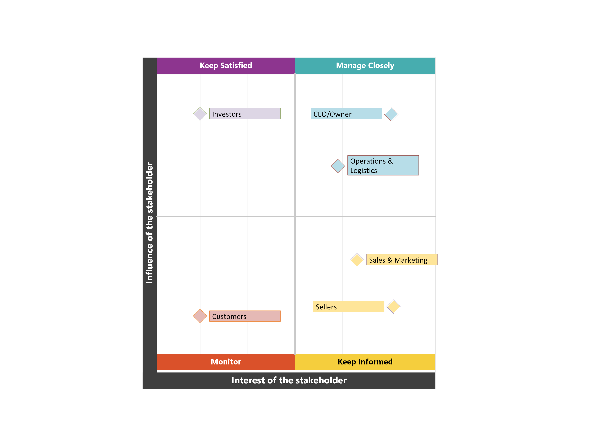

# Stakeholder Map

## Purpose

A stakeholder map identifies all parties impacted by or influencing the analysis, classifies them by power and interest, and determines the appropriate engagement strategy for each group. This is a standard Business Analyst artefact used to ensure the right people receive the right information at the right time.

---

## Stakeholder Classification Framework

Each stakeholder is classified across four dimensions:

1. **Type**: Internal (within Olist) or External (outside the organisation)
2. **Category**: Primary (directly affected) or Secondary (indirectly affected)
3. **Power**: Ability to influence decisions or allocate resources (High / Medium / Low)
4. **Interest**: Level of concern about the analysis outcomes (High / Medium / Low)

---

## Stakeholder Inventory

| Stakeholder | Type | Category | Power | Interest | Engagement Strategy |
|---|---|---|---|---|---|
| CEO/Owner | Internal | Primary | High | High | Manage Closely |
| Operations & Logistics | Internal | Primary | High | High | Manage Closely |
| Sales & Marketing | Internal | Secondary | Medium | High | Keep Informed |
| Investors | External | Primary | High | Medium | Keep Satisfied |
| Sellers | External | Primary | Low | High | Keep Informed |
| Customers | External | Secondary | Low | Low | Monitor |

---

## Power/Interest Grid

The grid above maps each stakeholder into one of four quadrants based on their power (vertical axis) and interest (horizontal axis). This visualisation determines the communication approach for each group.

---

## Stakeholder Profiles

### 1. CEO/Owner
**Grid Position**: Manage Closely (High Power, High Interest)

The CEO owns the final decision on geographic expansion strategy, seller acquisition investments, and logistics partnerships. This analysis directly informs capital allocation priorities for 2019 and beyond. The CEO needs:
- Executive summary with clear business impact quantification
- Prioritised recommendations tied to revenue growth potential
- Risk assessment if no action is taken

**Engagement Approach**: Present findings in person, provide detailed documentation for review, and be involved in final recommendation prioritisation.

---

### 2. Operations & Logistics Team
**Grid Position**: Manage Closely (High Power, High Interest)

This team is responsible for carrier relationships, delivery performance monitoring, and seller onboarding logistics. They have direct operational authority to negotiate regional carrier contracts and optimise fulfilment processes. They need:
- Granular data on delivery failures by route and carrier
- Freight cost breakdowns by state and distance
- Actionable metrics tied to underperforming delivery routes

**Engagement Approach**: Deep-dive working sessions to validate findings, collaborate on the feasibility of logistics recommendations, and co-develop implementation plans.

---

### 3. Sales & Marketing Team
**Grid Position**: Keep Informed (Medium Power, High Interest)

Sales and Marketing are responsible for seller acquisition campaigns and customer retention initiatives. They have moderate influence on strategy but high interest in understanding which regions to target and how to message Olist's value proposition in underserved markets. They need:
- Regional revenue potential analysis
- Seller concentration insights to guide recruitment priorities
- Customer satisfaction trends to refine messaging

**Engagement Approach**: Regular updates via reports and presentations. Solicit input on go-to-market feasibility, but do not require sign-off on technical recommendations.

---

### 4. Investors
**Grid Position**: Keep Satisfied (High Power, Medium Interest)

Investors hold significant influence over funding decisions but are less concerned with operational details. They care about revenue growth trajectory, market expansion viability, and capital efficiency. They need:
- High-level business case for geographic expansion
- Revenue concentration risk quantified
- ROI projections for logistics investments

**Engagement Approach**: Provide summary-level findings tied to business outcomes. Avoid operational details unless specifically requested.

---

### 5. Sellers (Platform Sellers)
**Grid Position**: Keep Informed (Low Power, High Interest)

Sellers are directly affected by any changes to logistics partnerships, freight subsidies, or platform policies, but they have limited individual power to influence Olist's strategic decisions. However, their collective behaviour (staying vs. leaving the platform) matters. They need:
- Transparency on how logistics improvements will reduce their costs
- Clarity on seller acquisition priorities in new regions
- Assurance that top-performing sellers remain prioritised

**Engagement Approach**: Communicate major changes through platform announcements, seller newsletters, and support channels. Gather feedback, but do not get involved in strategic planning.

---

### 6. Customers (End Buyers)
**Grid Position**: Monitor (Low Power, Low Interest)

Customers care about receiving their orders on time and at a reasonable cost, but they have no direct influence on Olist's internal strategy and limited awareness of the analysis itself. Their feedback is captured indirectly through review scores and repeat purchase behaviour. They need:
- Better delivery performance (outcome of this analysis, not the analysis itself)
- Lower freight costs in remote regions

**Engagement Approach**: No direct communication about this analysis. Improvements will be felt through better service quality.

---

## Key Insight

If the business questions confirm what is suspected, two stakeholders become critical to
any action that follows — **Operations & Logistics and the CEO**. Both carry high power
and high interest, but their priorities would pull in different directions:

- The CEO would focus on revenue growth and market expansion
- Ops would focus on operational feasibility and cost control

Any recommendation would need to satisfy both to gain traction. Additionally, if regional
underservice is confirmed, **Sales & Marketing would need early involvement** in any
seller acquisition strategy — as they would be executing the campaigns and need to validate targeting assumptions before rollout.

---

**Next Step**: Before proceeding with [Analysis](./4-analysis.md), I documented the [Current State](./3-current-state.md) to identify where delays occur.
