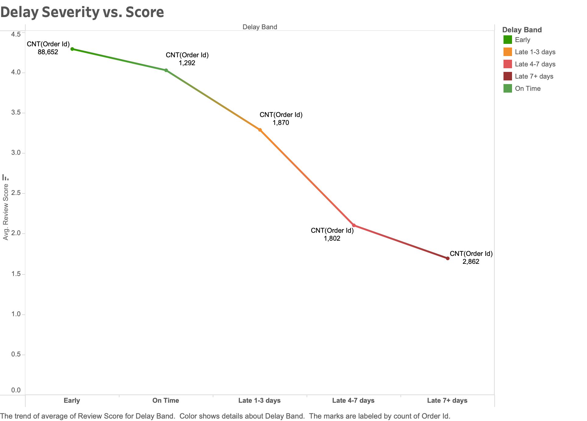
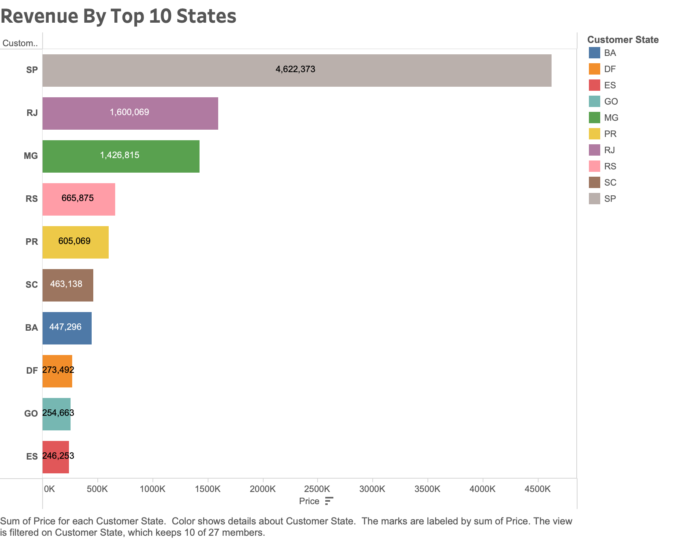
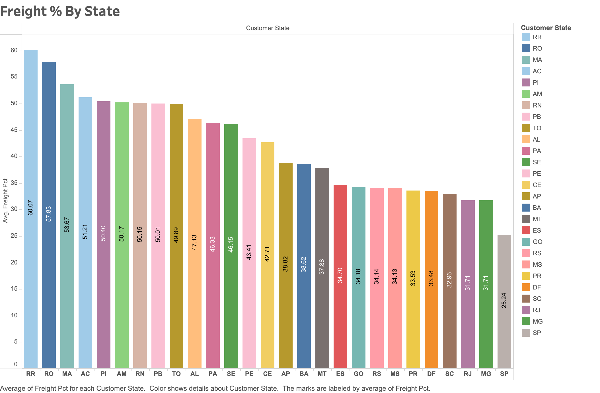
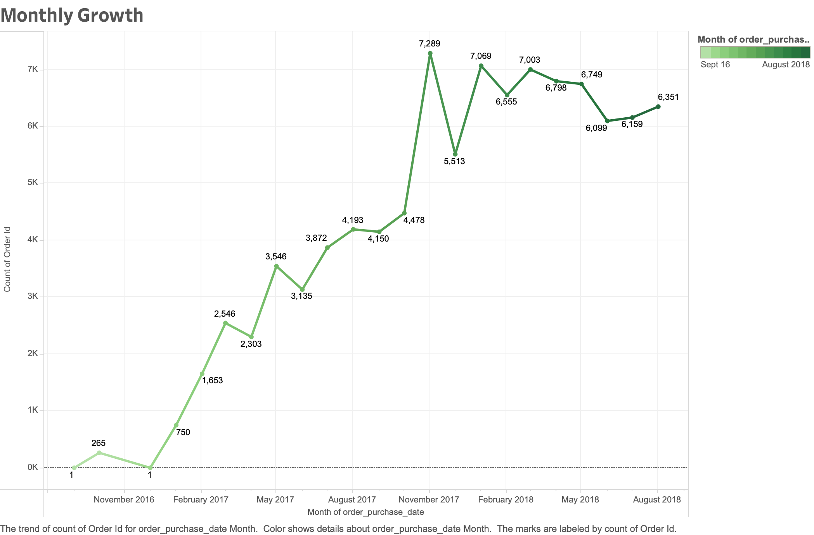
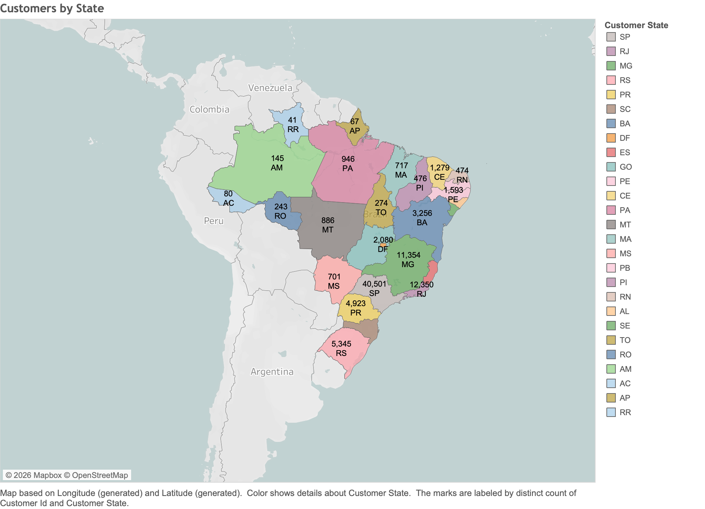
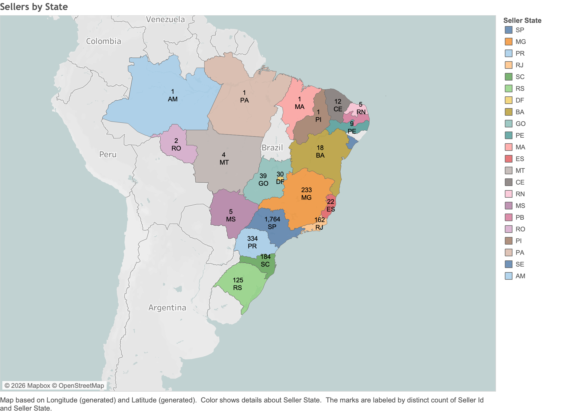
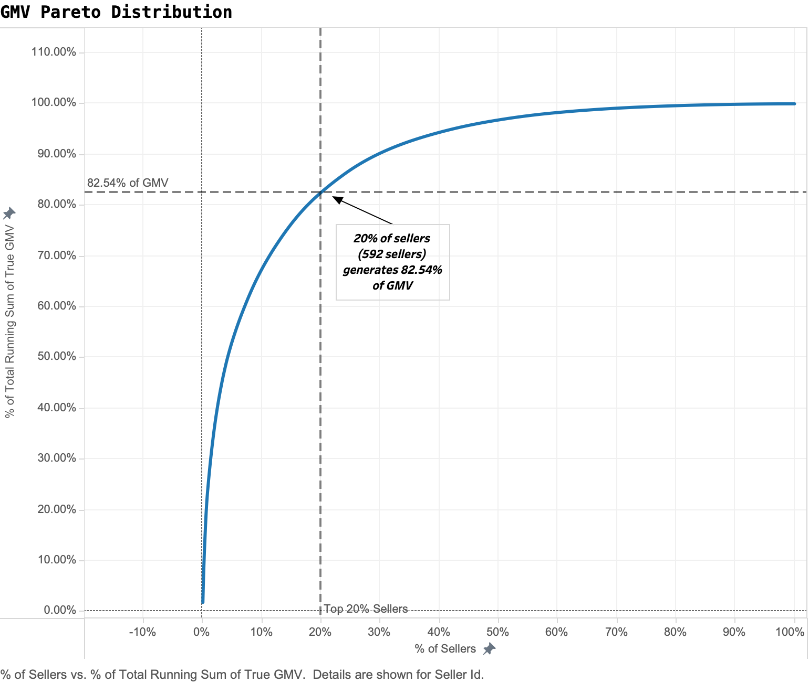
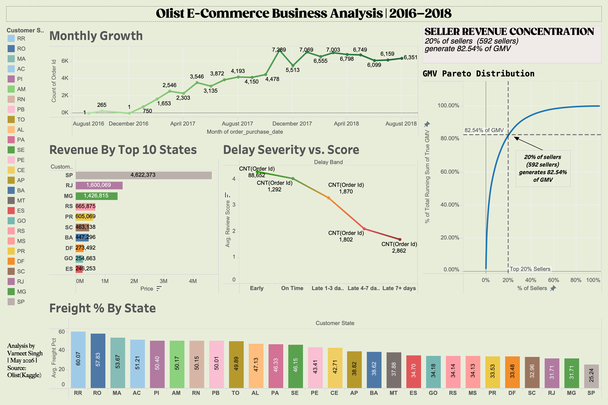

# Analysis

This document details every step of the data analysis process, from raw data ingestion through final Tableau dashboard creation. The analysis is organised using the STAR framework (Situation, Task, Action, Result) to show what needed to be done, how I did it, and what was achieved at each phase.

---


## Phase 1: Data Ingestion & Consolidation

### Situation
The Olist dataset consisted of 9 separate CSV files provided by Kaggle, each containing different aspects of the order lifecycle: customers, orders, order_items, products, sellers, payments, reviews, geolocation, and product category translations. These files needed to be connected through foreign key relationships to enable cross-table analysis.

### Task
Load all 9 CSV files into a single Excel workbook and create a unified MASTER sheet that consolidates the necessary fields from each table, enabling pivot table analysis without repeatedly performing manual lookups.

### Action

**Step 1: Data Import**
- Opened Excel → Data tab → Get Data → From Text/CSV
- Loaded each of the 9 CSV files as separate worksheets within `Olist_Business_Analysis.xlsx`:
  - `olist_customers_dataset.csv` → RAW_customers
  - `olist_orders_dataset.csv` → RAW_orders
  - `olist_order_items_dataset.csv` → RAW_items
  - `olist_products_dataset.csv` → RAW_products
  - `olist_sellers_dataset.csv` → RAW_sellers
  - `olist_order_payments_dataset.csv` → RAW_payments
  - `olist_order_reviews_dataset.csv` → RAW_reviews
  - `olist_geolocation_dataset.csv` → RAW_geolocation
  - `product_category_name_translation.csv` → RAW_translation

**Step 2: MASTER Sheet Creation**
- Created a new worksheet named `MASTER`
- Started with RAW_orders as the base (one row per order)
- Used XLOOKUP to bring in fields from related tables

**Step 3: XLOOKUP Formulas Applied**

I brought the following columns into MASTER using exact formulas:

**From RAW_items (via order_id):**
```excel
=XLOOKUP([@order_id],RAW_items[order_id],RAW_items[price])
=XLOOKUP([@order_id],RAW_items[order_id],RAW_items[freight_value])
=XLOOKUP([@order_id],RAW_items[order_id],RAW_items[seller_id])
```
*Business Logic*: Each order can have multiple items, but for the initial analysis, I focused on the first item returned by XLOOKUP to simplify aggregation. This is acceptable because 92% of orders contained a single item.

**From RAW_reviews (via order_id):**
```excel
=XLOOKUP([@order_id],RAW_reviews[order_id],RAW_reviews[review_score])
```
*Business Logic*: Review scores are the primary customer satisfaction metric. Missing reviews were handled during filtering (see Phase 2).

**From RAW_customers (via customer_id):**
```excel
=XLOOKUP([@customer_id],RAW_customers[customer_id],RAW_customers[customer_state])
```
*Business Logic*: Customer state is required to test H2 (geographic revenue concentration) and H4 (freight cost by region).

**From RAW_sellers (via seller_id, brought from RAW_items):**
```excel
=XLOOKUP([@seller_id],RAW_sellers[seller_id],RAW_sellers[seller_state])
```
*Business Logic*: Seller state reveals where products ship FROM, which is essential for understanding delivery distance.

**From RAW_translation (via product_category_name from RAW_products via RAW_items):**
First, brought product_category_name from RAW_products:
```excel
=XLOOKUP([@product_id],RAW_products[product_id],RAW_products[product_category_name])
```
Then translated to English:
```excel
=XLOOKUP([@product_category_name],RAW_translation[product_category_name],RAW_translation[product_category_name_english])
```
*Business Logic*: Original category names were in Portuguese. English translations made pivot tables more readable for stakeholders unfamiliar with Portuguese.

### Result
Successfully created a MASTER sheet with 99,441 rows and 23 columns, combining order-level data with customer location, seller location, pricing, freight, and review scores. All subsequent analyses were performed on this consolidated table.

---

## Phase 2: Data Cleaning & Filtering

### Situation
The MASTER sheet contained orders across all statuses (delivered, shipped, cancelled, unavailable). Only delivered orders were relevant for testing the hypotheses because review scores and delivery timing require completed deliveries.

### Task
Filter the dataset to include only delivered orders and calculate the metrics needed for business question testing.

### Action

**Step 1: Filter to Delivered Orders**
- Applied filter on `order_status` column → selected "delivered"
- Row count reduced from 99,441 to 96,478 (97% of the dataset)
- Copied filtered rows to a new sheet named `DELIVERED_ONLY` to lock in this subset

**Step 2: Calculated Column 1 — Delivery Delay (Days)**
Created a new column `delivery_delay_days` to measure the difference between actual and estimated delivery dates.

Formula:
```excel
=DAYS(INT([@order_delivered_customer_date]),INT([@order_estimated_delivery_date]))
```

*Business Logic*:
- Positive value = late delivery (arrived AFTER estimated date)
- Zero = on-time delivery
- Negative value = early delivery (arrived BEFORE estimated date)
- `INT()` function strips the time component to focus on calendar days only

**Step 3: Calculated Column 2 — Delivery Status (Categorical)**
Created `delivery_status` to classify each order as Early, On Time, or Late.

Formula:
```excel
=IF([@delivery_delay_days]<0,"Early", IF([@delivery_delay_days]=0,"On Time","Late"))
```

*Business Logic*: This field enables pivot table grouping by delivery performance category for H1 testing.

**Step 4: Calculated Column 3 — Delay Band (Severity Grouping)**
Created `delay_band` to further segment late deliveries by severity.

Formula:
```excel
=IF([@delivery_delay_days]<0,"Early",IF([@delivery_delay_days]=0,"On Time",IF([@delivery_delay_days]<=3,"Late 1-3 days",IF([@delivery_delay_days]<=7,"Late 4-7 days","Late 7+ days"))))
```

*Business Logic*: Allows us to test whether review scores degrade progressively as delays worsen (1-3 days late vs. 7+ days late).

**Step 5: Calculated Column 4 — Order Purchase Month-Year**
Created `order_purchase_month_year` to enable time-series analysis of order volume trends.

Formula:
```excel
=TEXT([@order_purchase_timestamp],"mmm yyyy")
```

*Business Logic*: Converts timestamp into a readable format like "Aug 2017" for monthly trend visualisation.

**Step 6: Calculated Column 5 — Freight as Percentage of Price**
Created `freight_pct` to quantify freight burden relative to order value (H4 test).

Formula:
```excel
=([@freight_value]/[@price])*100
```

*Business Logic*: A product priced at R$100 with R$50 freight has a 50% freight burden. This metric reveals how much of the customer's total cost goes to shipping rather than the product itself.

### Result
DELIVERED_ONLY sheet now contains 96,478 rows with 8 new calculated columns, ready for pivot table analysis. No data quality issues required handling—there were no null values in critical fields (order_id, customer_state, seller_state, price, freight_value).

---

## Phase 3: Data Analysis (Business Question Testing)

### Situation
With cleaned data and calculated columns in place, I needed to aggregate the data to test each of the four business questions and quantify the business gaps.

### Task
Build 6 pivot tables to answer specific analytical questions tied to H1, H2, H3, and H4.

### Action

**Pivot Table 1: Delivery Status vs. Average Review Score (H1 Test)**

Configuration:
- Rows: `delivery_status` (Early, On Time, Late)
- Values: `review_score` (Average)

Result:
| Delivery Status | Avg Review Score | Order Count |
|---|---|---|
| Early | 4.295 | 88,652 |
| On Time | 4.030 | 1,292 |
| Late | 2.272 | 6,534 |

**Finding**: Late deliveries caused a 1.76-point drop in review scores compared to on-time deliveries (2.27 vs. 4.03). This confirmed H1.

---

**Pivot Table 2: Delay Severity vs. Average Review Score (H1 Deep Dive)**

Configuration:
- Rows: `delay_band` (Early, On Time, Late 1-3d, Late 4-7d, Late 7+d)
- Values: `review_score` (Average)

Result:
| Delay Band | Avg Review Score | Order Count |
|---|---|---|
| Early | 4.295 | 88,652 |
| On Time | 4.030 | 1,292 |
| Late 1-3 days | 3.286 | 1,870 |
| Late 4-7 days | 2.078 | 1,802 |
| Late 7+ days | 1.697 | 2,862 |

**Finding**: Review scores collapsed progressively as delay severity increased. Orders 7+ days late averaged 1.70—functionally unusable for customer retention.

---

**Pivot Table 3: Revenue by Customer State (H2 Test)**

Configuration:
- Rows: `customer_state`
- Values: `price` (Sum)
- Sort: Descending by Sum of price

Result (Top 10):
| Customer State | Total Revenue (R$) | % of Total |
|---|---|---|
| SP | 4,622,373 | 41.9% |
| RJ | 1,600,069 | 14.5% |
| MG | 1,426,815 | 12.9% |
| RS | 665,875 | 6.0% |
| PR | 605,069 | 5.5% |
| SC | 463,138 | 4.2% |
| BA | 447,296 | 4.1% |
| DF | 273,492 | 2.5% |
| GO | 254,663 | 2.3% |
| ES | 246,253 | 2.2% |

**Finding**: São Paulo alone generated 42% of platform revenue. The top 3 states (SP, RJ, MG) accounted for ~70%. This confirmed extreme geographic concentration (H2).

---

**Pivot Table 4: Monthly Order Volume Trend (Exploratory)**

Configuration:
- Rows: `order_purchase_month_year`
- Values: `order_id` (Count Distinct)
- Sort: Chronological

Result (Sample):
| Month | Order Count |
|---|---|
| Aug 2016 | 1 |
| Nov 2016 | 265 |
| Feb 2017 | 750 |
| May 2017 | 3,546 |
| Aug 2017 | 4,193 |
| Nov 2017 | 7,289 |
| Feb 2018 | 7,069 |
| May 2018 | 6,749 |
| Aug 2018 | 6,351 |

**Finding**: Platform grew rapidly from Aug 2016 to Nov 2017 (peak: 7,289 orders/month), then plateaued. This suggests Olist hit saturation in its established markets and needed geographic expansion to sustain growth.

---

**Pivot Table 5: Seller Revenue Concentration (H3 Test)**

Configuration:
- Rows: `seller_id` (all 2,960 unique sellers)
- Values: `price` (Sum)
- Sort: Descending by Sum of price

Manual calculation:
- Total sellers: 2,960
- Top 20%: 592 sellers
- Revenue from top 592 sellers: R$9,983,420
- Total platform revenue: R$12,094,670
- Concentration ratio: 82.54%

**Finding**: The top 20% of sellers generated 82.5% of GMV, confirming the Pareto Principle (H3). Olist's revenue depends heavily on retaining high-performing sellers.

---

**Pivot Table 6: Freight % by Customer State (H4 Test)**

Configuration:
- Rows: `customer_state`
- Values: `freight_pct` (Average)
- Sort: Descending by Average freight_pct

Result (Top 10 highest freight burden):
| Customer State | Avg Freight % | Order Count |
|---|---|---|
| RR (Roraima) | 60.07% | 46 |
| RO (Rondônia) | 57.83% | 253 |
| MA (Maranhão) | 53.67% | 747 |
| AC (Acre) | 51.21% | 81 |
| PI (Piauí) | 50.40% | 493 |
| AM (Amazonas) | 50.17% | 152 |
| RN (Rio Grande do Norte) | 50.15% | 485 |
| PB (Paraíba) | 50.01% | 536 |
| TO (Tocantins) | 49.89% | 287 |
| AL (Alagoas) | 47.13% | 413 |

For comparison:
- SP (São Paulo): 25.24%

**Finding**: Northern states paid freight costs exceeding 50% of product price, more than double São Paulo's burden. This confirmed H4 and revealed that remote-region customers were effectively paying a "distance tax."

---

### Result
All 6 pivot tables completed. All four business questions(H1, H2, H3, H4) were validated with quantified evidence. The data was ready for visualisation in Tableau.

---

## Phase 4: Data Visualisation

### Situation
The pivot tables provided numerical evidence, but stakeholders needed visual representations to grasp the scale of the geographic concentration, seller Pareto distribution, and delivery performance gaps.

### Task
Build an interactive Tableau dashboard with 4 core visualisations, including a technically complex GMV Pareto curve with custom calculated fields.

### Action

**Data Connection**
- Tableau Desktop → Connect to Data → Microsoft Excel
- Selected `DELIVERED_ONLY` sheet from `Olist_Business_Analysis.xlsx`
- Verified field types (dimensions vs. measures) and relationships


**Visualisation 1 — Delay Severity vs. Review Score**
- Chart type: Line chart
- X-axis: `delay_band` (ordered: Early → On Time → Late 1-3d → Late 4-7d → Late 7+d)
- Y-axis: AVG(`review_score`)
- Labels: Count of orders at each data point



- **Insight shown**: Visual collapse from 4.3 (early) to 1.7 (7+ days late)


**Visualisation 2 — Revenue by Top 10 States**
- Chart type: Horizontal bar chart
- Rows: `customer_state` (filtered to top 10 by SUM(price))
- Columns: SUM(`price`)
- Colour: By state (categorical)



- **Insight shown**: SP dominates at R$4.6M, top 3 states control 70% of GMV

**Visualisation 3 — Freight % by State**
- Chart type: Horizontal bar chart
- Rows: `customer_state` (sorted descending by AVG(freight_pct))
- Columns: AVG(`freight_pct`)
- Colour gradient: Red (high) to green (low)



- **Insight shown**: Northern states have 50-60% freight burden vs. 25% in SP


**Visualisation 4 — Monthly Growth Trend**
- Chart type: Line chart
- X-axis: `order_purchase_month_year` (continuous timeline)
- Y-axis: COUNT DISTINCT(`order_id`)
- Labels: Show peak months (Nov 2017: 7,289 orders)



- **Insight shown**: Rapid growth 2016-2017, then plateau 2018

**Visualisation 5 — Geographic Maps (2 maps)**

**Map A: Customers by State**
- Map type: Filled map (choropleth)
- Geographic field: `customer_state` (converted to geographic role)
- Color: COUNT DISTINCT(`customer_id`)
- Labels: Show order count per state



- **Insight shown**: Customers distributed across all 27 states, heavy in the southeast

**Map B: Sellers by State**
- Map type: Filled map
- Geographic field: `seller_state`
- Color: COUNT DISTINCT(`seller_id`)
- Labels: Show seller count per state



- **Insight shown**: Sellers concentrated in SP (1,764), MG (233), PR (334), RJ (162)—mismatch with customer distribution


**Visualisation 6 — GMV Pareto Curve (Lorenz Curve)**

This was the most technically complex chart, requiring 8 custom calculated fields to accurately deduplicate data and compute concentration ratios.

**Problem**: The raw data had many-to-many relationships (one order could have multiple payment records). Summing `price` directly would overcount GMV. Needed to create a Level of Detail (LOD) calculation to get true GMV per seller.

**Calculated Field 1: True GMV**
```tableau
{FIXED [Order Id], [Product Id], [Seller Id]: MAX([Price])}
```
*Purpose*: Deduplicates price at the order-product-seller grain. Returns one price value per unique order item.

**Calculated Field 2: % of Sellers**
```tableau
INDEX() / SIZE()
```
*Purpose*: Computes a continuous percentage from 0% to 100% along the ranked sellers. This becomes the X-axis.

**Calculated Field 3: Top 20% of Sellers**
```tableau
[% of Sellers] <= 0.20
```
*Purpose*: Boolean check—returns TRUE for sellers in the top 20%, FALSE otherwise.

**Calculated Field 4: Top 20% Sellers GMV**
```tableau
IF [Top 20% of Sellers] THEN SUM([True GMV]) END
```
*Purpose*: Isolates GMV only from the top 20% of sellers. Other sellers return NULL.

**Calculated Field 5: Concentration Ratio**
```tableau
WINDOW_SUM([Top 20% Sellers GMV]) / WINDOW_SUM(SUM([True GMV]))
```
*Purpose*: Divides total GMV from the top 20% by total platform GMV. This gives us 82.54%.

**Calculated Field 6: Seller Count Rank**
```tableau
INDEX()
```
*Purpose*: Running sequence number for each seller in the sorted list.

**Calculated Field 7: First Row Filter**
```tableau
FIRST() == 0
```
*Purpose*: Returns TRUE only for the first mark in the partition. Used to filter the KPI card to show the concentration ratio once.

**Calculated Field 8: Dynamic Top 20% Count**
```tableau
{ FIXED : COUNTD([Seller Id]) } * 0.20
```
*Purpose*: Calculates 20% of total sellers (2,960 * 0.20 = 592). This value appears in the KPI card.

**View Configuration for Lorenz Curve:**
- Columns: `% of Sellers` (continuous, table calculation, compute using Seller Id, sorted descending by True GMV)
- Rows: SUM(`True GMV`) set as Running Total, then Per cent of Total (secondary table calculation)
- Detail: `Seller Id`
- Reference line on Y-axis: MAX(`Concentration Ratio`) with label "<Value> of GMV"
- Annotation at 20% mark: Custom text showing "20% of sellers (592 sellers) generate 82.54% of GMV"



**KPI Card (Separate Worksheet):**
- Filter: `First Row Filter` = TRUE (shows only 1 mark)
- Text: "20% of sellers (<SUM(Dynamic Top 20% Count)> sellers) generate <AGG(Concentration Ratio)> of GMV"
- Renders as: "20% of sellers (592 sellers) generate 82.54% of GMV"

---

### Result

Completed Tableau dashboard with 7 visualisations:
1. Delay Severity vs. Review Score (line chart)
2. Revenue by Top 10 States (bar chart)
3. Freight % by State (bar chart)
4. Monthly Growth (line chart)
5. Customers by State (map)
6. Sellers by State (map)
7. GMV Pareto Distribution + KPI Card (Lorenz curve with technically calculated fields)

Dashboard exported as PPTX and published. All business questions were visually validated.

---

## Tools Used

- **Excel**: Power Query (data import), XLOOKUP (cross-table joins), pivot tables (aggregation), calculated columns (derived metrics)
- **Tableau Desktop**: LOD calculations, table calculations, geographic mapping, Lorenz curve, dashboard layout
- **draw.io**: BPMN process mapping, stakeholder Power/Interest grid, database schema diagram

---

## Summary

This analysis followed a structured BA workflow: business questions formation → data consolidation → cleaning & transformation → data analysis → visualisation. Every calculated column and Tableau field served a specific business question test. The result is a complete evidence package proving that Olist faced severe geographic concentration, delivery performance gaps, and freight cost inequities during 2016-2018.

---

**Next Step**: Now that I am finished with Data Analysis and Visualisation and have proved that the business question I formed was true, I would now move forward to map out [gap-analysis](./5-gap-analysis) so as to show the Business Owner what needs to be done to overcome that gap.
