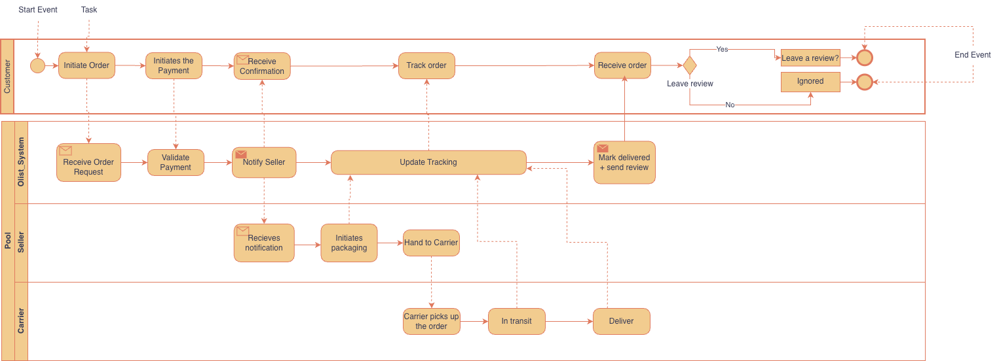

# Current State (AS-IS)

## Purpose

This document maps the operational order fulfillment process as it existed during the 2016–2018 period captured by the dataset. Understanding the current state is essential for identifying where delays occur, where customer experience breaks down, and where process improvements should be targeted.

---

## AS-IS Process Map (BPMN Swimlane Diagram)

The diagram above uses Business Process Model and Notation (BPMN) to show the end-to-end order fulfillment flow across four actors:

1. **Customer** (top lane)
2. **Olist System** (second lane)
3. **Seller** (third lane)
4. **Carrier** (bottom lane)

---

## Process Flow Description

### Customer Lane

1. **Initiate Order**: Customer selects a product and begins the checkout process on one of Olist's partner platforms (Mercado Livre, B2W, etc.).

2. **Initiates the Payment**: Customer completes payment through the platform's payment gateway.

3. **Receive Confirmation**: After payment validation, the customer receives an order confirmation notification.

4. **Track Order**: Customer monitors delivery status through the platform's tracking interface.

5. **Receive Order**: Physical delivery occurs when the carrier hands over the package.

6. **Gateway: Leave a Review?**: Decision point where the customer either chooses to leave a review or ignores the prompt.
   - **Yes** → Proceeds to "Leave a review?" step
   - **No** → Proceeds to "Ignored" step
   - Both paths terminate at the End Event

---

### Olist_System Lane

1. **Receive Order Request**: Olist's backend receives the order details from the marketplace platform.

2. **Validate Payment**: System confirms payment was successfully processed before notifying the seller.

3. **Notify Seller**: Olist sends order details to the responsible seller, triggering the fulfillment process.

4. **Update Tracking**: As the seller and carrier update shipment status, Olist's system reflects these changes in the customer-facing tracking interface.

5. **Mark Delivered + Send Review**: Once the carrier confirms delivery, the system marks the order as delivered and sends a review request to the customer.

---

### Seller Lane

1. **Receives Notification**: Seller receives the order details and payment confirmation from Olist.

2. **Initiates Packaging**: Seller picks, packs, and prepares the product for shipment.

3. **Hand to Carrier**: Seller transfers the packaged order to the carrier for transportation.

**Pain Point**: The time gap between "Receives Notification" and "Hand to Carrier" is the first source of delay. Sellers vary widely in their packing speed and operational efficiency.

---

### Carrier Lane

1. **Carrier Picks Up the Order**: Logistics partner collects the package from the seller's location.

2. **In Transit**: Package travels through the carrier's distribution network toward the customer's delivery address.

3. **Deliver**: Final-mile delivery to the customer.

**Pain Point**: The "In Transit" step is where geographic distance becomes critical. Orders to northern and remote states experience significantly longer transit times due to sparse logistics infrastructure and fewer available routes.

---

## Key Observations from the Current State

### 1. Sequential Handoffs Create Cumulative Delay Risk

The process involves three handoff points:
- Olist → Seller (notification)
- Seller → Carrier (package transfer)
- Carrier → Customer (delivery)

Each handoff introduces potential delay. If the seller is slow to pack (handoff 1) and the carrier has limited routes to remote regions (handoff 2–3), delays compound rather than offset.

### 2. No Visibility into Seller Packing Time

The dataset includes:
- `order_purchase_timestamp`
- `order_approved_at`
- `order_delivered_carrier_date`
- `order_delivered_customer_date`

However, there is no explicit timestamp for when the seller completed packing. This means delays between "Notify Seller" and "Hand to Carrier" are hidden within the `order_delivered_carrier_date` field. We know delays happen here, but we can't measure their magnitude directly.

### 3. Review Prompt Is Sent After Delivery

The gateway "Leave a Review?" occurs after the customer receives the order. This means that delivery experience—whether the package arrived on time, late, or damaged—directly influences whether the customer engages with the review prompt and what score they assign. Late deliveries not only frustrate customers but also reduce the likelihood of receiving any review at all (customers who are unhappy may choose "Ignored" instead of leaving a poor review).

### 4. Geographic Distance Is Not Accounted for in Estimated Delivery Dates

The `order_estimated_delivery_date` field is calculated by the platform at checkout, but the dataset does not reveal whether this estimate considers:
- The seller's location
- The customer's location
- Current carrier capacity in that route

If estimated dates are overly optimistic for remote regions, customers will perceive late deliveries even when carriers are performing at their operational best.

---

## Root Causes Identified in the Current State

Based on the process map and the dataset structure, three structural issues emerge:

1. **Seller Concentration in São Paulo**: Most sellers operate from SP, which means orders to northern states must travel extreme distances. The process was not designed for long-haul fulfillment.

2. **Carrier Infrastructure Gaps**: The "In Transit" step is the longest for remote regions because carriers have fewer warehouses, sorting centers, and delivery vehicles in northern Brazil compared to the southeast.

3. **No Process Differentiation by Region**: The same fulfillment workflow applies whether a customer is in São Paulo (same-city delivery) or Roraima (cross-country delivery). There is no separate expedited route, priority seller assignment, or regional carrier partnership to handle remote orders differently.

---

## Implications for Gap Analysis

The current state reveals **where** problems occur:
- Seller packing delays (hidden in data)
- Long transit times to remote states (visible in data)
- Late deliveries causing review score collapse (visible in data)

The next step is to define the **desired future state** (TO-BE) and measure the gap between current performance and target performance. This is documented in [Gap Analysis](./gap-analysis.md).
